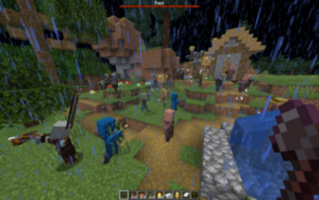

{: .image-left } **LargeRaids** was first released in 18th of August, 2021. The user story came about me playing on a Towny server, grinding raids for emeralds and totems. The default raids seem really trivial to beat, hardly posing any challenges for a group of players. I was in search of plugins that modify the raid mechanics, but to no avail. Undoubtedly, raid plugins seemed less than an essential to most servers.

It wasn't long before I came to also realise the challenges of developing such a plugin. Spigot's API is rather limited in terms of how much you can manipulate raids. The best that you can do is changing an ongoing raid's bad omen level, which is by itself limited. (Ab)using NMS packages isn't straight forward either. Number of waves are hard coded according to the world's difficulty; number of mobs in a wave are pre-determined; heroes of a raid are automatically rewarded with a status effect; mystery on how to create artificial village centers was unsolved, and so on. Not to mention that NMS isn't an API with proper documentation, and the implementations of certain classes are missing.

Although I have listed my plugin as premium, I hope plugin developers pay more attention to raids. I think it can really enhance vanilla survival's game experience. I have therefore decided to [open-source this plugin](https://github.com/zhenghanlee/LargeRaids). Regardless, many thanks for those who supported the premium resource on Spigot.

