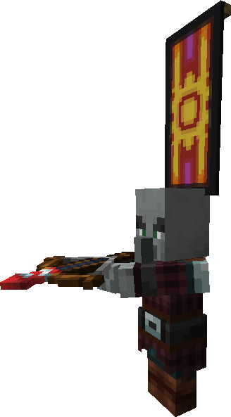
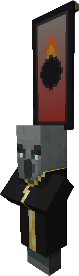

<h1 style="font-weight: bold">Firework Pillager</h1>

{: .image-right } **Firework Pillagers** are pillager variants that shoot powerful firework rockets from their crossbows. The firework rockets have the same explosive power as those made from 5 fireballs and will not damage the shooter or any other raiders. They also have double the health of normal pillagers.

<h1 style="font-weight: bold">Bomber</h1>

{: .image-right } **Bombers** are raiders that summons bomber vexes and creating a line of explosions towards the target. Villagers/players caught directly in his lines of explosions will be sent up high enough to die from fall damage if not under any kind of protection. The explosions created by the bomber have no effect on other raiders. TNTs dropped by bomber vexes, however, deal damage to anyone in the vicinity.

