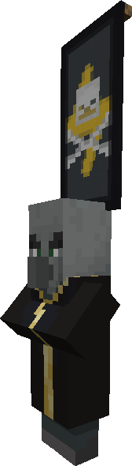
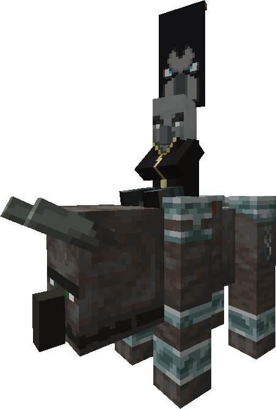

<h1 style="font-weight: bold">Firework Pillager</h1>

{: .image-right } **Firework Pillagers** are pillager variants that shoot powerful firework rockets from their crossbows. The firework rockets have the same explosive power as those made from 5 fireballs and will not damage the shooter or any other raiders. They also have double the health of normal pillagers.

<h1 style="font-weight: bold">Bomber</h1>

{: .image-right } **Bombers** are raiders that summons bomber vexes and creating a line of explosions towards the target. Villagers/players caught directly in his lines of explosions will be sent up high enough to die from fall damage if not under any kind of protection. The explosions created by the bomber have no effect on other raiders. TNTs dropped by bomber vexes, however, deal damage to anyone in the vicinity.

<h1 style="font-weight: bold">Necromancer</h1>

{: .image-right } **Necromancers** are raiders that summons the undead and lightning bolts to strike its targets. Specifically, he summons zombies to attack villagers, and skeletons to attack players. The zombies he summons wear carved pumpkins on their heads while the skeletons wear chainmail helmets to prevent them from burning under the sun during the day. *Do not let your villagers out in the open or they will be turned into witches by his lightning and become a raider!*

<h1 style="font-weight: bold">King Raider</h1>

{: .image-right }

> "The sky darkens as the horns blare, the toughest raider is your despair!"

**King Raiders** are boss raiders who ride on **Juggernauts**. King Raiders are invulnerable as long as they are attached to their Juggernauts. They also summon vexes holding diamond swords, enchanted with Fire Aspect II and Sharpness III. The fire fangs they create deals 3 hearts of damage regardless of protection, and set his targets on fire. Juggernauts are also tough to deal with. They have three times the health of normal ravagers, which also regenerates really fast. Kill it faster!

