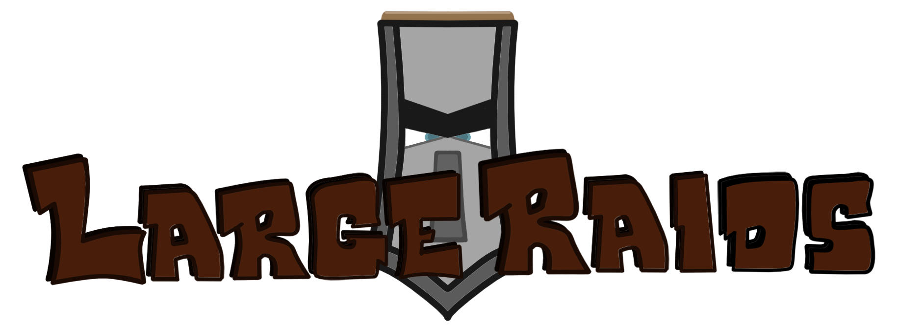

**LargeRaids** is a vanilla Spigot game experience enhancement plugin for [raids](https://minecraft.fandom.com/wiki/Raid), which are added to the game in the _Village & Pillage Update_. It expands the raid's mechanism to accommodate for the multiplayer environment with higher difficulty, higher bad omen levels, more raiders, more waves and higher rewards.

<h1 style="font-family: Luminari">Server Requirements</h1>

The plugin is generally meant for game versions 1.14.x - 1.18.x. More specifically, the supported NMS versions are:

- 1_14_R1 (1.14, 1.14.1, 1.14.2, 1.14.3, 1.14.4)
- 1_15_R1 (1.15, 1.15.1, 1.15.2)
- 1_16_R3 (1.16.4, 1.16.5)
- 1_17_R1 (1.17, 1.17.1)
- 1_18_R1 (1.18, 1.18.1)
- 1_18_R2 (1.18.2)

You may also refer to the corresponding versions [here](https://www.spigotmc.org/wiki/spigot-nms-and-minecraft-versions-1-16/) to check if your server version is supported.

<h1 style="font-family: Luminari">Support</h1>

Approach our [Discord server](https://discord.gg/YSv7pptDjE) or [Github Issues](https://github.com/zhenghanlee/LargeRaids/issues) for support. This can include bug reporting, usages and suggestions. You are also welcome to put up your suggestions on our [Spigot Discussion page](https://www.spigotmc.org/threads/largeraids-1-14-x-1-18-x.521752/).

<h1 style="font-family: Luminari">bStats</h1>

<h1 style="font-family: Luminari">Sponsors</h1>

Use code **`LARGERAIDS`** at checkout to receive a **15% discount** on the first month for any new StellaNode product.

<h1 style="font-family: Luminari">Donation</h1>

Thank you for your kind donations! This is an individual project, and your support means a lot to me. If you are donating with Debit/Credit Card, put an identifiable billing name (e.g. Discord username) so that I know who you are. Join our [Discord server](https://discord.gg/YSv7pptDjE) and you will receive a *donor role* on Discord regardless of the amount you donated!

<label for="amount"> </label><input name="amountInput" type="number" id="amount" value="" > USD

    
Please enter an amount

