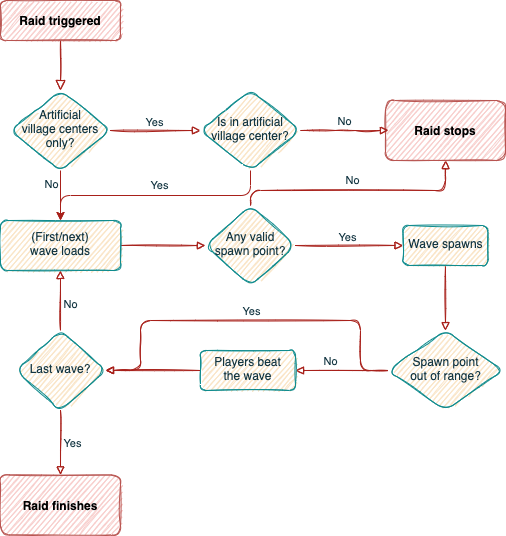

## Triggering Mechanism

### Bad Omen

The main triggering mechanism of the plugin, where every raid in the server turns into a large raid. As such, it is inadvisable to enable this mechanism alongside others at the same time.

A large raid have at least 5 waves. With bad omen level of 6 or higher, the raid will have equal the number of waves as its bad omen level. _This differs from a normal raid, where bad omen level of 2 or higher entails a bonus round._

> 🚨 **IMPORTANT**: Bad omen effect given by commands may cause bugs!

> ❓ **TRIVIA**: If a player leaves a village during a raid, obtains another level of Bad Omen, and returns to the village in the next wave, then the effect will be absorbed by the progressing raid, increasing its bad omen level.

The maximum number of waves is set by the `raid.waves` configuration option in `config.yml`, instead of depending on individual worlds' difficulties.

### Dropping Item into Lava

This triggering mechanism is inspired by Terraria, where players summon the Wall of Flesh by throwing a Voodoo Doll into lava. The summoning item can be configured in `config.yml` and set as a crate reward (command/item). Upon throwing the summoning item into lava within the vicinity of a village, a raid will be triggered. The raid will have the maximum bad omen level, set by the `raid.waves` configuration option in `config.yml`.

> 💡 **TIP**: You can create maps with a lava well as an artificial village center to make a cool raid arena.

### New Moon

This mechanism aims to surprise unprepared players loitering around villages in a midnight with a new moon. The raid will have the maximum bad omen level, set by the `raid.waves` configuration option in `config.yml`.

## Behaviour

{: .image-center }

Large raids mimic the behaviour of normal raids, sharing mostly similarities. Hence, it can be easily defeated yet again given enough preparation, altering of landscape or taking advantage of it, such as raid grinders in the middle of oceans. Hence, an `artificial-only` configuration option is provided in the `config.yml`.

If `artificial-only` is enabled, then large raids can only be triggered around registered artificial village centers. As the game takes surrounding occupied village blocks/points of interest (POI) to determine a raid center, artificial village centers must be at least 128 blocks/8 chunks away from each other and other villager-claimed POIs (e.g. job block, bed, bell) to maximum the effective area for triggering large raids. As the bad omen triggering mechanism turn every raid into a large raid, no raid (normal/large) can be triggered in normal villages if `artificial-only` is enabled.

